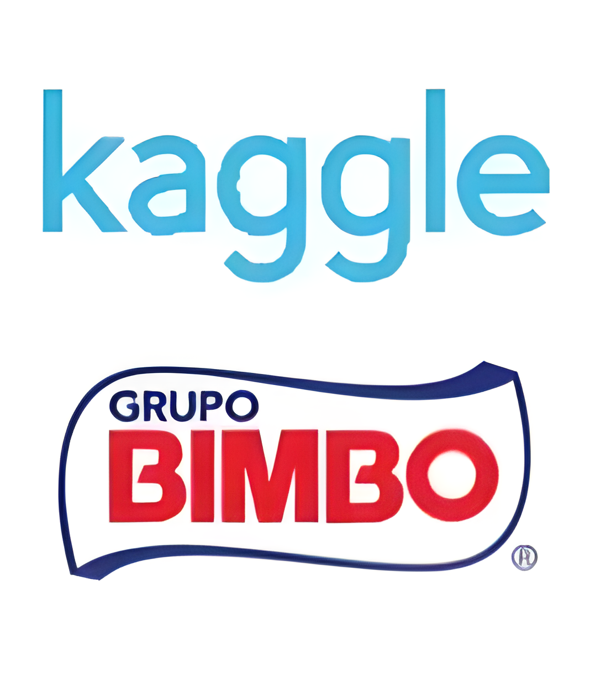

# **Bimbo Inventory Demand **

   Olá! Meu nome é Pablo e na outra aba você encontra meu projeto. esse é um projeto que fiz baseado em uma competição do Kaggle, onde usamos XGboost para prever a demanda por produtos da marca Bimbo. Minhas redes estão no final do relatório, entre em contato!

